##### Fraud_Detection

1. Objective:
    
    * Credit card frauds are easy and friendly targets. With the growth of the e-commerce industry and community, we see credit card fraud rise at rates faster than ever. In 2018, the United States alone accounted for $9.4 billion in fraud loss compared to the $27.85 billion lost worldwide.
    * My friend's credit card info was stolen after she used it to pay at the QT gas station. 
    * I wanted to design and develop a novel credit card fraud detection model for streaming transaction data, to analyze the past transaction details of the customers and extract the behavioural patterns.

2. About The Data:
    
    * The datasets contains transactions made by credit cards in September 2013.These transactions occured in two days, and there are 17 frauds out of 8,000 transactions.
    * PCA (Principal Component Analysis)- an unsupervised, non-parametric statistical technique is used for dimensionality reduction in machine learning. Features from v1 - v28 are the results of this PCA
    * Other features (except 'Time' and 'Amount') are anonymized to protect the privacy of the customers.
    * Feature 'Time' is the time elapsed between each transaction and the first transaction
    * Feature 'Amount' depicts the amount of each transaction
    * Feature 'Class' is the dependent variable/target variable. 1 means fraudulent, and 0 means genuine.
    
3. Solutions:

    * As the data is very skewed - there are only 0.21% fraudulent transactions in the 8k samples - accuracy is not a good metric: any "model" predicting ALL are normal transactions will have a 99.79% accuracy.
    * Imbalanced classes makes 'accuracy' unreliable and it must be addressed before building our models. There are several techniques to treat imbalanced classes such as up-sample minority class, down-sample majority class,...etc. This study focuses on up-sampling minority classes
    * A comparison between the performance metrics of two logistic models before and after applying imbalanced treatment shows the improvement of the other performance metrics in terms of precision, recall, and F1 scores
    * Models are trained and tested for accuracy, precision, and recall (sensitivity) 

I. Feature Distributions:

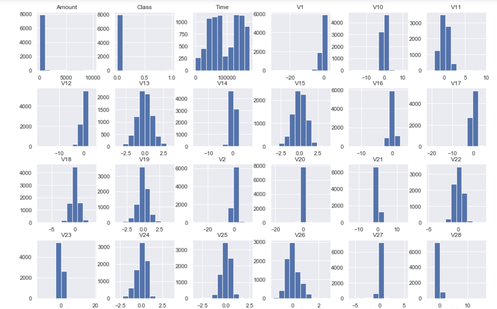

* Annotations:
    * There are two columns in the 'Amount' feature. We can assume that the tall - dominant column is associated with the valid transactions whereas the very low-barely notice column is corresponding with the fraudulent transactions
    * There should be two columns in the 'Class' feature. The number of frauds isn't showed due to its significantly small compare to the number of valid transactions
    * Time is measured in seconds. The parabolas shape indicates many transactions occur at the same time
Some of the Vs - PCA components have some what skew and bell shape. The x variable expands in both negative and postive regions

II. Correlation Heatmap

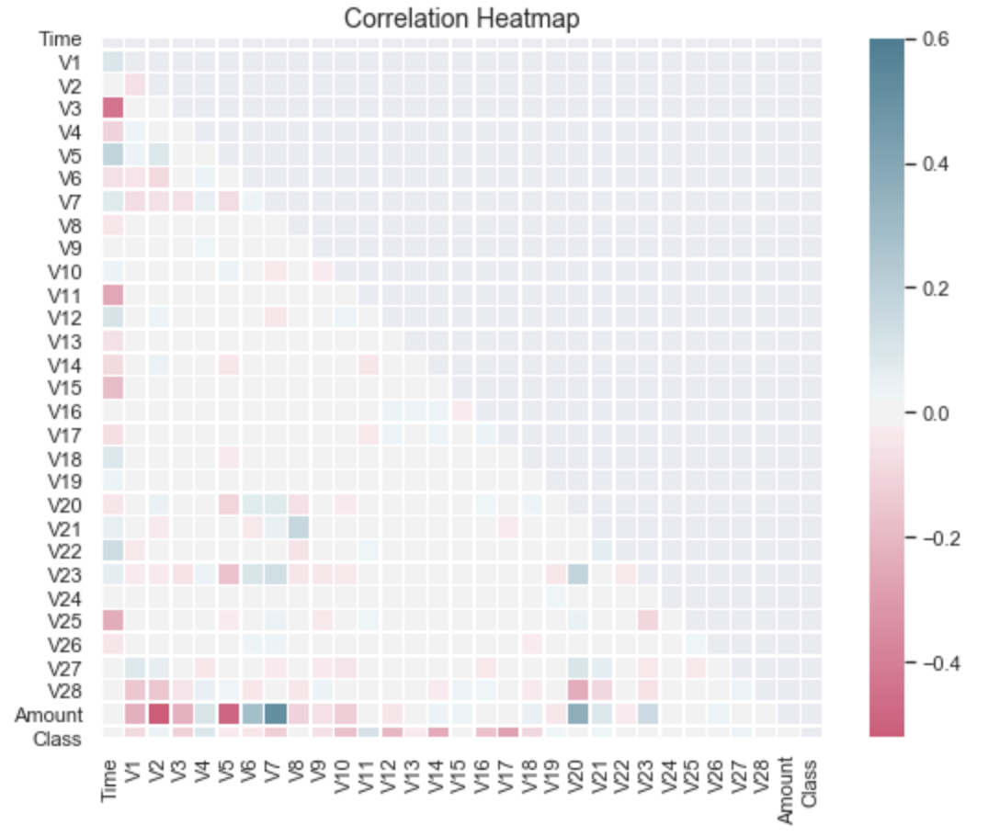

* Annotations:
    * None of the V1 to V28 has any correlation to each other
    * 'Class' don't have any correlation with 'Amount' or 'Time', but it does have some form of positive and negative (mostly low negative) correlations with the 'V' components
    * 'Amount' does have some high positive correlations with V7 and V20, and high negative correlations with the V2 and V5 components

III. Fraud vs Not-Fraud Distribution

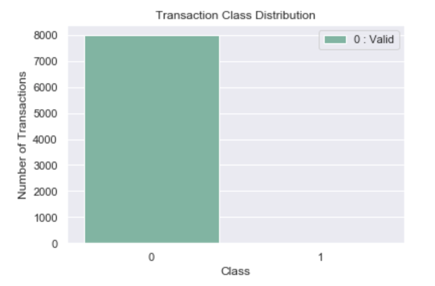

* Annotations:
    * There are 17 fraud transactions out of 8000 transactions during 2 consecutive days in September.
    * This highly unbalance with respect to target variable 'Class' needs to be treated before building our models.
    * Our target variable is 'Class' feature. The other PCA features are labeled from V1 to V28 except 'Time' and 'Amount' are independent variables
    * The target variable has 2 classes: Not-Fraud: 0, Fraud: 1. This is a typical binary classification.
From the 'Class' feature, we can see only one class: 0- Not-Fraud, the other class 1-Fraud is barely showed. 
    * The danger of imbalanced classes is that the model will always predict class 0 which means it's completely ignore the minority class 1-Fraud in favor of the majority class: 0-not-Fraud.
    
IV. Fraudulent Transactions Trend

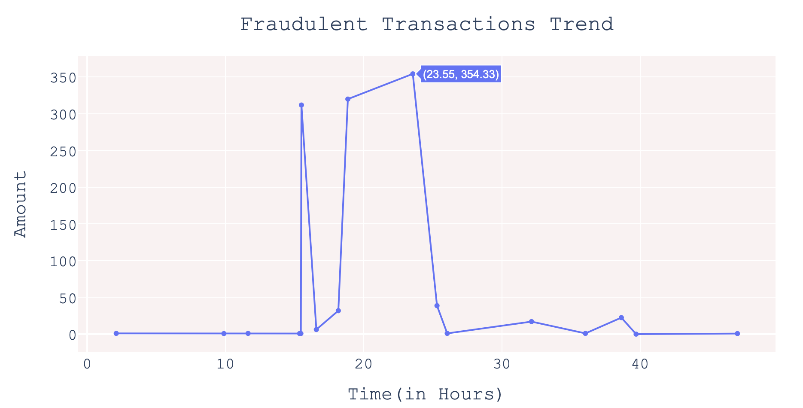

* Notes:
    * There are 17 fraudulent transactions over 48 hours on Sep 13th,2013. Thirteen of them are less than 50 euros per transaction.
    * The largest amount is 354.33 euros occured at the end of the 24 hours
    * Why the amount for each transaction is relatively small? Why, where, and how are some questions the banks should investigate

V. Valid Transactions Trend

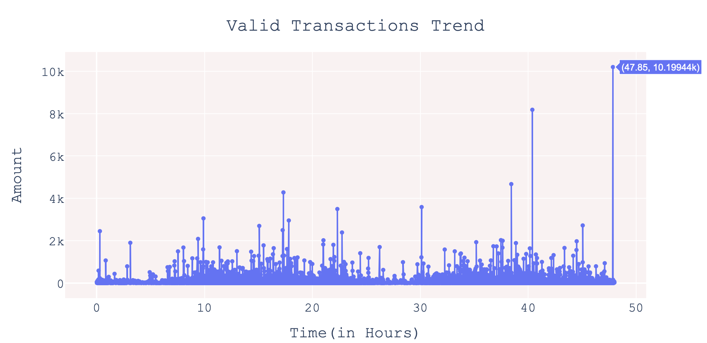

* Notes:
    * The first valid transaction occured at 0.02 hour with the amount of 34.7 euros. 
    * The last valid transaction happend at the end of the 48 hours in investigation with the amount of 10,199 euros.

VI. Models

    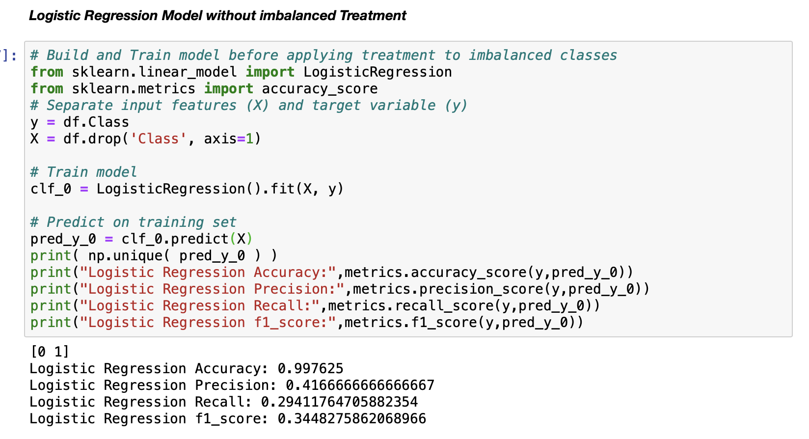
    
    * This is our model before applying imbalanced treatment to the 'Class' feature
    * Accurarcy is very high 99.76% as expected because the imbalance is 0.02%
    * But precision, recall, and f1_score are very low
    * It is unacceptable 
    
2. Performance metrics concepts:

    
    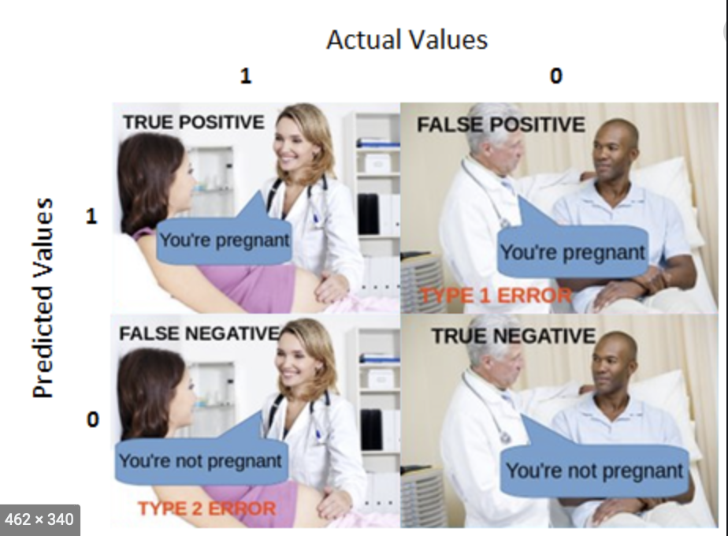
    
    
    * I found that the images of man and woman's pregnancy explain quite well the concepts of True positive, True negative, False positive, and False negative. 
    * Precision, Recall (Sensitivity or True positive rate), Accuracy, and F1 score all can be deduced from mathematical formulas

3. How to handle an imbalanced Class in Machine Learning
   
* Up-sample Minority Class:
    
    * Upsampling is the process of randomly duplicating observations from the minority class in order to reinforce its signal.
    * The most common way is to simply resample with replacement
    
* How we do it?
    
    * First, we'll separate observations from each class into different DataFrames
    * Second, we resample the minority class with replacement, setting the number of samples to match that of the majority class.
    * Last, we'll combine the up-sampled minority class DataFrame with the original majority class DataFrame
    
    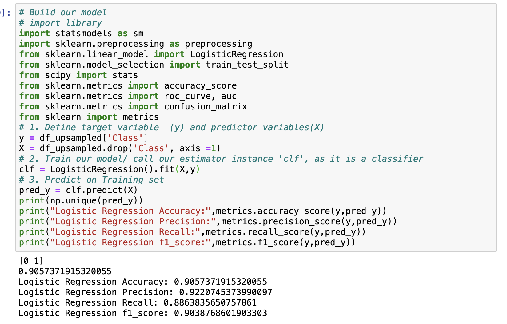
    
    * This is our model after up-sampling the fradulent class. This training model is highly yield acceptable results
    * Accuracy descreases but still in acceptable range of 90% 
    * Recall or sensitivity is high 88.6% is the ability our model accurately predicts fraudulent transactions
    * Our model gives a precision of 92.2% meaning that all of fraudulent transactions that our model predicted, we are correct 92.2% of the time.
    
    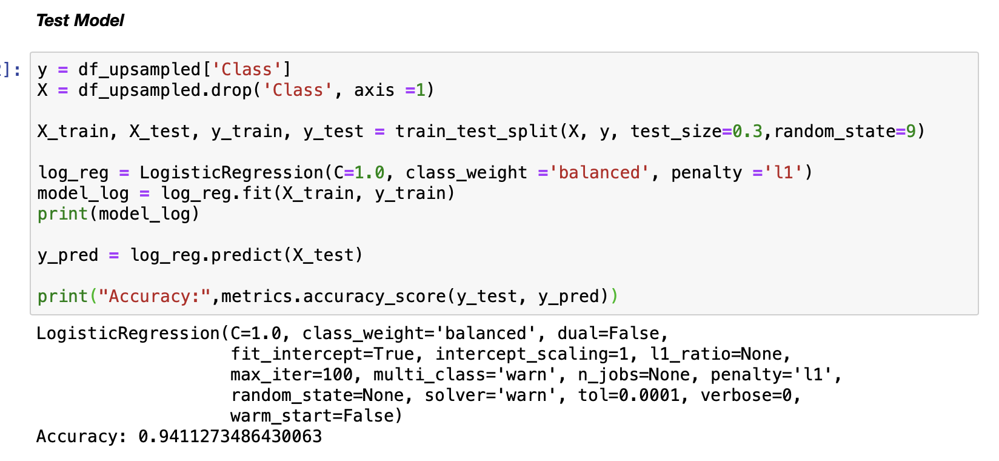
    
VII-1. Evaluation Models using Confusion Matrix
 
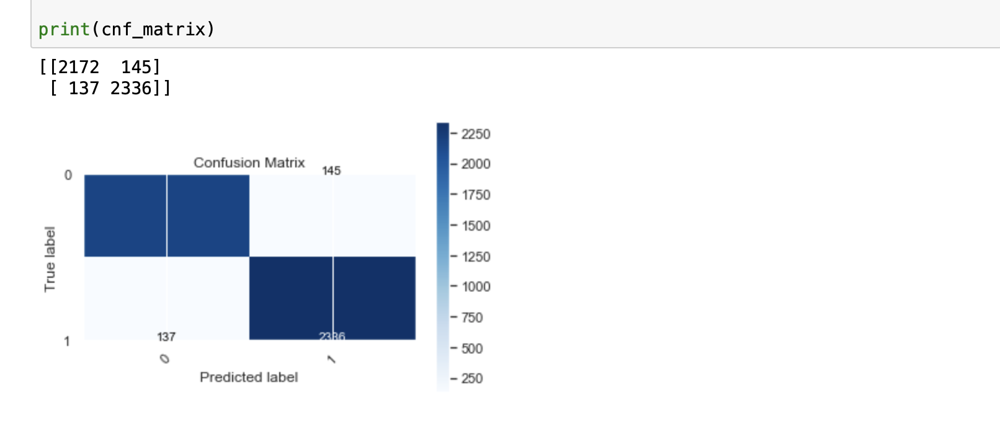
     
    
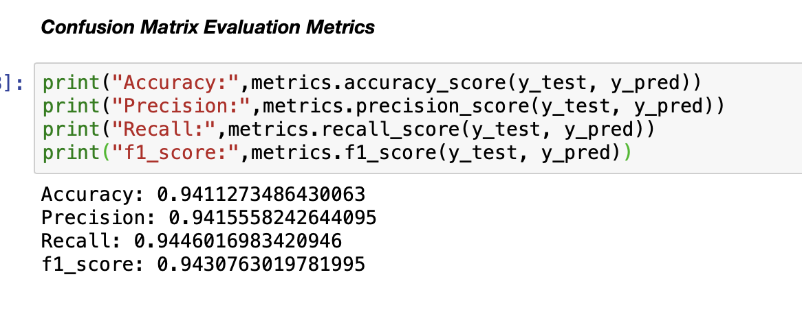
     

VII-2. Evaluation Models using AUROC

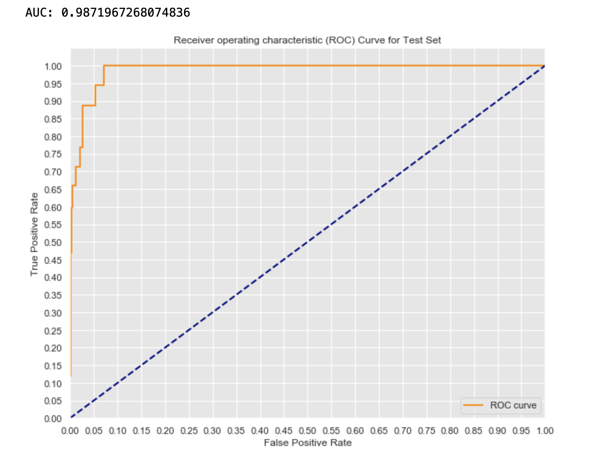
    

VIII. Key-takeaways

    * I was working with a heavy imbalance data. Out of 8k transactions within 48 hours only 17 are frauds.
    * My first model had a very high accuracy of 98%, but low precision 41%, recall 29%, and f1-score 34% which was unacceptable. 
    * I have learned that to build reliable models with heavily imbalanced data, I need to treat the unbalanced data first. After ‘up sampling’ the fraudulent data, my model produced high yield in accuracy, precision, and recall. 
    * My final model yielded an accuracy of 90%, precision 92%, recall 88.6% and f1-score 90.38%.

IX. Challenging

     * The most challenging while working on this project was to figure out which technique I would use to treat imbalanced classes in machine learning. 
     * If handled improperly, my model was useless because it couldn’t detect fraudulent transactions even though yielding high accuracy. 
     * There were several techniques out there and I had to test each of them, and came up with the ‘Up Sampling’ method that yielded acceptable results.
    
X. How would I improve or extend my models if I have more time in the future?

    * My model was very good in capturing fraudulent transactions with highly reliable accuracy. 
    * It was able to analyze the past transaction details of the customers such as time, amount, and behaviour patterns. 
    * However, when the dataset is not big enough, the model can overlook a seemingly obvious connection such as a shared card between two accounts.
    * To encounter this, and if I have time, I would enhance my model with Graph networks.
    * Graph DB will allow me to block suspects and their accounts before they have taken any fraudulent action.

     
     

